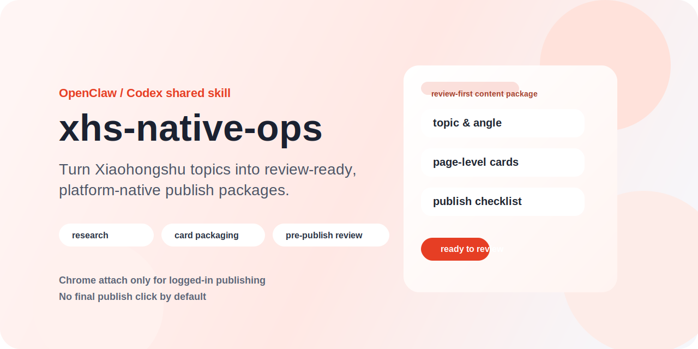

<p align="center">
  
</p>

<p align="center">
  <a href="https://github.com/guguclaw2026-cloud/xhs-native-ops/blob/main/LICENSE"></a>
  
  
</p>

<h1 align="center">xhs-native-ops</h1>

<p align="center">
  A shared OpenClaw/Codex skill for turning Xiaohongshu topics into
  review-ready, platform-native publish packages.
</p>

<p align="center">
  It handles the execution layer: research synthesis, topic and angle design,
  page-level card planning, visual packaging, pre-publish checks, and
  review-ready handoff.
</p>

## Why this repo exists

Most Xiaohongshu automation projects solve one narrow problem:

- they can publish
- or they can scrape
- or they can generate images

`xhs-native-ops` is opinionated about the whole package:

- the content should feel Xiaohongshu-native
- the output should be page-based, not article-dumped
- the operator should review before publish
- logged-in actions should stay on a controlled Chrome attach path

This repo is for teams that want a **shared skill**, not a one-off script.

## What you get

- a standalone skill folder that can be copied into an OpenClaw workspace
- Python scripts for title checks, card generation, scoring, and checklist
  generation
- SVG-based cover and card templates
- a sample content package with generated outputs for smoke testing
- a structure that is easy to export, version, and adapt for GitHub

## Workflow


## 3-minute quick start

### 1. Install the skill

```bash
bash install-into-openclaw-workspace.sh
```

Default install target:

- `${OPENCLAW_HOME:-$HOME/.openclaw}/workspace/skills`

Custom install target:

```bash
bash install-into-openclaw-workspace.sh /path/to/skills-root
```

### 2. Run the sample package

From the repo root:

```bash
python3 xhs-native-ops/scripts/title_check.py \
  --title "做二次元出海后我最想交给AI的五件事" \
  > xhs-native-ops/examples/sample-package/titles.json

python3 xhs-native-ops/scripts/md_to_xhs_cards.py \
  --input xhs-native-ops/examples/sample-package/package.md \
  --output-dir xhs-native-ops/examples/sample-package/cards \
  --layout six

python3 xhs-native-ops/scripts/post_score.py \
  --input xhs-native-ops/examples/sample-package/package.md \
  > xhs-native-ops/examples/sample-package/score.json

python3 xhs-native-ops/scripts/publish_checklist.py \
  --input xhs-native-ops/examples/sample-package/package.md \
  --cards-dir xhs-native-ops/examples/sample-package/cards \
  > xhs-native-ops/examples/sample-package/publish-checklist.md
```

### 3. Check the outputs

Expected outputs:

- `xhs-native-ops/examples/sample-package/titles.json`
- `xhs-native-ops/examples/sample-package/score.json`
- `xhs-native-ops/examples/sample-package/cards/`
- `xhs-native-ops/examples/sample-package/publish-checklist.md`

## Who this is for

This repo is a good fit if you want:

- a shared skill for OpenClaw or Codex
- review-ready Xiaohongshu packaging, not just raw automation
- a page-level content workflow
- a controlled publishing boundary for logged-in browser work

This repo is **not** a good fit if you want:

- a fully autonomous growth agent
- one-click no-review auto publishing
- account-specific persona logic baked into the skill
- a generic social scheduler for every platform

## Hard boundaries

- shared skill only; no account-specific persona
- compatible with upstream research outputs, but does not require them
- final publish click remains human-owned by default
- logged-in publish work must use Google Chrome + Chrome DevTools MCP attach
- PinchTab must not be used for logged-in publish actions
- relay-style browser paths are out of scope

## Repo layout

```text
xhs-native-ops/
├── README.md
├── .gitignore
├── install-into-openclaw-workspace.sh
└── xhs-native-ops/
    ├── SKILL.md
    ├── _meta.json
    ├── agents/openai.yaml
    ├── references/
    ├── scripts/
    ├── assets/
    └── examples/sample-package/
```

## Key files

- skill entry: `xhs-native-ops/SKILL.md`
- sample run contract:
  `xhs-native-ops/references/sample-run.md`
- artifact formats:
  `xhs-native-ops/references/artifact-formats.md`
- implementation pitfalls:
  `xhs-native-ops/references/implementation-pitfalls.md`

## What the skill actually produces

The working package contract is:

- `package.md`
- `titles.json`
- `score.json`
- `cards/`
- `publish-checklist.md`

The generated `cards/` directory is page-level output, not article-style output.

## Publishing model

`xhs-native-ops` is **review-first** by default:

- the agent can build the package
- the agent can score and checklist the package
- the agent can prepare the Chrome attach workflow
- the final publish confirmation stays human-owned unless explicitly overridden

## Status

Current repo state is a GitHub-ready project skeleton for the `xhs-native-ops`
skill, with a runnable v0.1 sample package.
